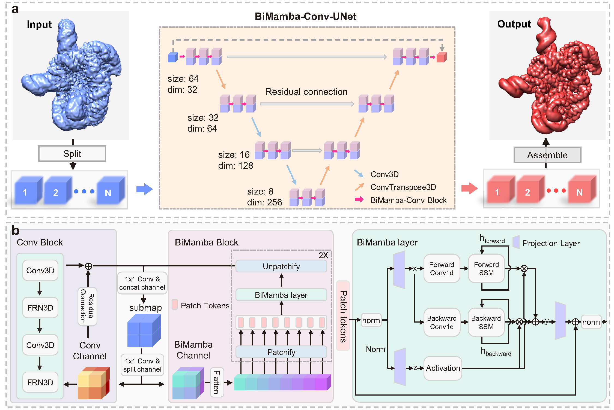

# EMReady_mamba

## 📄 Overview

Universal improvement of cryo-EM and cryo-ET maps  by fast quality-aware deep learning with Mamba

<a href="#"></a>  <a href="https://mit-license.org/"></a>

<a href="https://pytorch.org/"></a>   <a href="https://developer.nvidia.com/cuda-toolkit"></a>   <a href="https://python.org"></a>

Copyright (C) 2025 Hong Cao, Yueting Zhu, Tao Li, Ji Chen, Jiahua He, Xinggang Wang, Sheng-You Huang and Huazhong University of Science and Technology




## ✨ Requirements

**Platform**: Linux (Mainly tested on CentOS 7).

**GPU**: A GPU with >10 GB memory is required, advanced GPU like A100 is recommended.

**CUDA**: CUDA>=11.8 is a must because mamba needs it.


## ⚡ Installation

### 1. Download EMReady

Download EMReady via github
```
git clone https://github.com/huang-laboratory/EMReady-Mamba.git
cd EMReady-Mamba
```

### 2. Create conda environment
```
conda create -n emready_mamba python==3.10
conda activate emready_mamba
```

### 3. Install packages
```
pip install torch==2.3.1 torchvision==0.18.1 torchaudio==2.3.1 --index-url https://download.pytorch.org/whl/cu118
pip install -r requirements.txt
```

### 4. Install mamba
```
pip install -r requirements_mamba.txt
```
If **requirements_mamba.txt** fails to install, possibly due to network fluctuations, you can also check the emready_mamba environment using the following two lines of code and download the corresponding version from the official website.

**Check the torch version and cuda version**
```python
python -c "import torch; print(torch.__version__); print(torch.version.cuda)"
```
Expected Output:
```
2.3.1+cu118
11.8
```

****Check the CXX11 ABI settings of PyTorch****
```python
python -c 'import torch; print(torch._C._GLIBCXX_USE_CXX11_ABI); print(torch.compiled_with_cxx11_abi())'
```
Possible Output:
```
False or True
```
Download **causal-conv1d==1.4.0** from [https://github.com/Dao-AILab/causal-conv1d/releases](https://github.com/Dao-AILab/causal-conv1d/releases)
Download **mamba-ssm==2.2.2** from [https://github.com/state-spaces/mamba/releases](https://github.com/state-spaces/mamba/releases)

Manually install it locally in the emready_mamba environment, replacing 'xxx' with the corresponding version.
```
pip install causal_conv1d-1.4.0_xxx.whl
pip install mamba_ssm-2.2.2_xxx.whl
```

### 5. Set the EMReady.sh
Set **"EMReady_home"** to the root directory of EMReady_mamba, for example, if EMReady is unzipped to "/home/data/EMReady-Mamba", set `EMReady_home="/home/data/EMReady-Mamba"`

Set **"active"** to path of conda activator, for example
```
activate="/home/data/anaconda3/bin/activate
```

set **"EMReady_env"** to name of the python conda virtual environment that have all the required packages installed. An conda environment named "emready_env" will be created using the quick installation command, so `EMReady_env="emready_mamba"`. If the environment is built with a different name, users should modify **"EMReady_env"** accordingly.


## 🎯 Usage
Running EMReady_mamba is very straight forward with one command like
```
EMReady.sh in_map.mrc out_map.mrc [Options]
```
Required arguments:
```     
in_map.mrc:  File name of input EM density map in MRC2014 format.
out_map.mrc:  File name of the output EMReady-processed density map.
```

Options:
```
-g  GPU_ID:  ID(s) of GPU devices to use. e.g. '0' for GPU #0, and '2,3,6' for GPUs #2, #3, and #6. (default: '0')
-s  STRIDE:  The step of the sliding window for cutting the input map into overlapping boxes. Its value should be an integer within [16,48]. (default: 16)
-b  BATCH_SIZE:  Number of boxes input into EMReady_mamba in one batch. (default: 16)
-m  MASK_MAP:  Input mask map in MRC2014 format. (default: None)
-c  MASK_MAP_CONTOUR:  Set the contour level of the mask. (default: 0.0)
-p  MASK_STRUCTURE:  Input structure mask files in PDB or CIF format (default: None)
-r  MASK_STRUCTURE_RADIUS:  Zone radius in angstroms (default: 4.0)
-mo  MASK_OUT_PATH:  File path of the output binary mask map. (default: None)
--inverse:  Inverse the mask.
```


## 📝 Citation

If you find our work useful, please cite our related paper:
```
@article{EMReady_mamba_2025,
	title = {Universal improvement of cryo-EM and cryo-ET maps  by fast quality-aware deep learning with Mamba},
	author = {Hong Cao, Yueting Zhu, Tao Li, Ji Chen, Jiahua He, Xinggang Wang, Sheng-You Huang},
	journal = {In submission},
	year = {2025},
}
```
